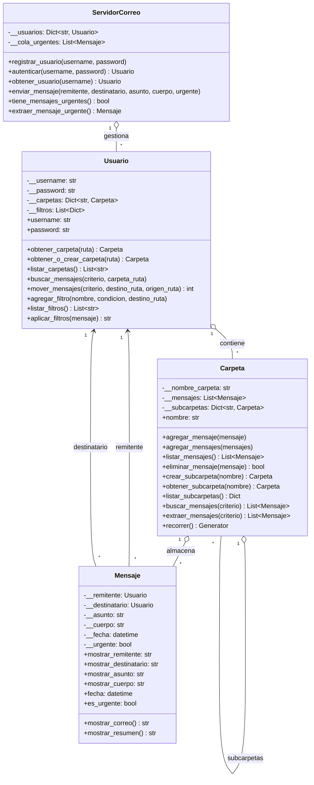

# TP - Servidor de Correo

- Se realizaron las correcciones solicitadas en la ultima entrega con respecto a la lógica de recursividad de las carpetas y subcarpetas permitiendo las operaciones de busqueda y movimiento de mensajes.
- Se integró la librería de "pytest" para verificar el correcto funcionamiento del servidor.
- Se amplió el Abstract.md para mejorar la documentación del código, en caso de que aún debamos completar cosas por favor comentarlos en la devolución.

## Objetivos

- Modelar las clases principales: ServidorCorreo, Usuario, Carpeta y Mensaje.
- Aplicar encapsulamiento mediante atributos privados y propiedades/métodos de acceso.
- Implementar una interfaz mínima de interacción (registro, autenticación y envío/listado de mensajes).
- Ver también el [Abstract](./docs/abstract.md) con objetivos, decisiones y alcance.
- Automatizar la clasificación de mensajes mediante filtros configurables por usuario.
- Priorizar mensajes urgentes utilizando una cola de prioridad dedicada.

## Complejidad y eficiencia

- **Búsqueda recursiva**: la búsqueda recorre todas las carpetas y subcarpetas de forma recursiva. En el peor caso es `O(n)` donde `n` es la cantidad total de mensajes almacenados en todo el árbol de carpetas.
- **Movimiento de mensajes**: la extracción y reubicación también recorre recursivamente, con complejidad `O(n)` en el peor caso si se visita cada carpeta del árbol.
- **Aplicación de filtros**: por cada mensaje recibido se evalúan las reglas configuradas (`O(r)` donde `r` es la cantidad de filtros del usuario). La evaluación se detiene cuando un filtro coincide.
- **Cola de urgentes (FIFO)**: las inserciones al inicio y extracciones al final de la lista son `O(1)` amortizado. No se usa prioridad numérica; el orden es por llegada (primero en llegar, primero en salir).

## Casos límite considerados

- **Carpetas inexistentes**: al intentar mover mensajes hacia una carpeta que no existe, el sistema informa el error o crea la carpeta automáticamente según la configuración del usuario.
- **Búsquedas sin resultados**: se devuelve una lista vacía sin generar errores.
- **Cola de urgentes vacía**: al consultar mensajes urgentes cuando no hay ninguno pendiente, se informa al usuario sin fallar.
- **Filtros con carpetas destino ausentes**: pueden crearse automáticamente (si `crear_destino=True`) o ignorarse si el usuario prefiere no crear carpetas nuevas.

## Diagrama de clases (UML)



## Cómo probar rápidamente

Ejecuta el demo incluido:

```powershell
# Windows PowerShell
python -m app.main
```

## Pruebas automáticas

Se añadieron pruebas unitarias con `pytest` para cubrir la búsqueda recursiva, el movimiento de mensajes, la aplicación de filtros y la cola de urgentes.

```bash
pip install pytest  # en caso de no tenerlo instalado
pytest -q
```

## Manual de uso

- Ejecutar el código con `python -m app.main` desde la raíz del proyecto.
- Seleccionar alguna de las opciones listadas en el menú:
  - **Registrarse o ingresar** con usuario y contraseña.
  - **Enviar mensajes** a otros usuarios registrados, marcándolos como urgentes si es necesario.
  - **Ver mensajes** de Entrada o Enviados, seleccionando un mensaje para leer el contenido completo.
  - **Crear subcarpetas** anidadas (ejemplo: `Entrada/Proyectos/2025`).
  - **Buscar y mover mensajes** por texto en asunto o cuerpo, de forma recursiva en toda la jerarquía.
  - **Configurar filtros** por asunto para organizar la bandeja automáticamente.
  - **Ver mensajes urgentes** pendientes desde el menú de usuario (se extraen en orden de llegada).

## Próximos pasos

- Implementar interfaz gráfica con tkinter.

## Modalidad de trabajo:

- Se colaboró en conjunto, y se trabajó con LiveShare permitiendo un desarrollo coordinado.
