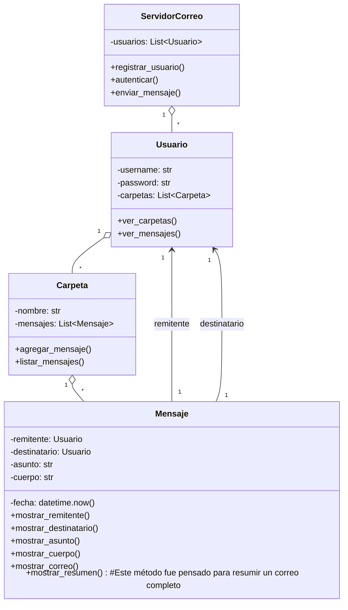

# TP - Servidor de Correo

Se realizaron las correcciones solicitadas en la primer entrega, respecto a la modularización del proyecto para incrementar la mantenibilidad del código. Ademas se agregó la carpeta docs con un archivo abstract.md donde se argumentan las desiciones del diseño.

## Objetivos

- Modelar las clases principales: ServidorCorreo, Usuario, Carpeta y Mensaje.
- Aplicar encapsulamiento mediante atributos privados y propiedades/métodos de acceso.
- Implementar una interfaz mínima de interacción (registro, autenticación y envío/listado de mensajes).
- Ver también el [Abstract](./docs/abstract.md) con objetivos, decisiones y alcance.

## Diagrama de clases (UML)



## Cómo probar rápidamente

Ejecuta el demo incluido:

```powershell
# Windows PowerShell
python -m app.main
```

## Manual de uso:

- Ejecutar el codigo
- Seleccionar alguna de las opciones listadas del menú

## Proximos pasos:

- Implementar menú con el Framework tkinter
- Gestionar el envío de mensajes con un metodo "enviar_mensaje"
- Implementación del método de mostrar_resumen

## Modalidad de trabajo:

- Se colaboró en conjunto, y se trabajó con LiveShare permitiendo un desarrollo coordinado.
