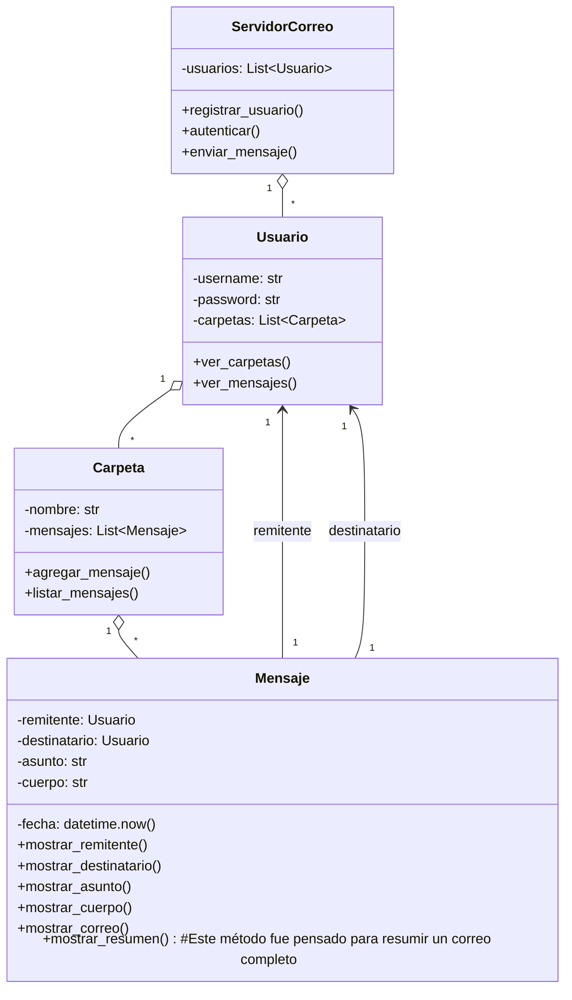

# TP - Servidor de Correo (Primera entrega)

Se va a desarrollar un modelo de servidor de correo, donde el usuario debera registrarse y enviara mensajes a otros usuarios registrados dentro del servidor.
Por defecto se dejo configurado un usuario registrado para la verificación de funcionalidad del mismo.

## Objetivos

- Clases principales: `Usuario`, `Mensaje`, `Carpeta`, `ServidorCorreo`.
- Encapsulamiento mediante propiedades y métodos de acceso.
- Documentación con diagrama de clases.


## Diagrama de clases (UML)



## Cómo probar rápidamente

Ejecuta el demo incluido:

```powershell
# Windows PowerShell
python .\app.py
```

## Manual de uso:

- Ejecutar el codigo
- Seleccionar alguna de las opciones listadas del menú

## Proximos pasos:

- Implementar menú con el Framework tkinter
- Realizar diagrama de flujo en Figma. 
- Gestionar el envío de mensajes con un metodo "enviar_mensaje"
- Implementación del método de mostrar_resumen

## Modalidad de trabajo:
	- Se colaboró en conjunto, y se trabajó con LiveShare permitiendo un desarrollo coordinado.
