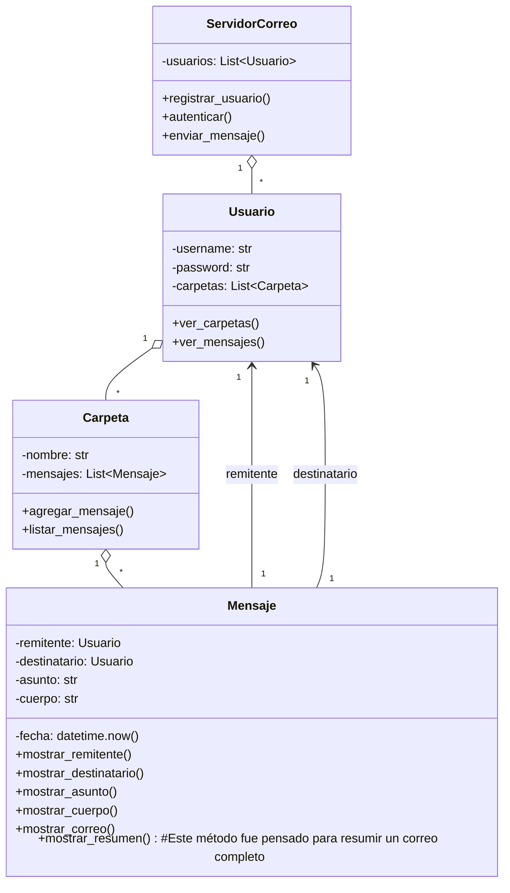

# TP - Servidor de Correo

Se realizaron las correcciones solicitadas en la primer entrega, respecto a la modularización del proyecto para incrementar la mantenibilidad del código. Ademas se agregó la carpeta docs con un archivo abstract.md donde se argumentan las decisiones del diseño.
Ademas se implementó el metodo para enviar mensajes.

## Objetivos

- Modelar las clases principales: ServidorCorreo, Usuario, Carpeta y Mensaje.
- Aplicar encapsulamiento mediante atributos privados y propiedades/métodos de acceso.
- Implementar una interfaz mínima de interacción (registro, autenticación y envío/listado de mensajes).
- Ver también el [Abstract](./docs/abstract.md) con objetivos, decisiones y alcance.
- Automatizar la clasificación de mensajes mediante filtros configurables por usuario.
- Priorizar mensajes urgentes utilizando una cola de prioridad dedicada.

## Complejidad y eficiencia

- **Búsqueda y filtrado**: la búsqueda recorre todas las carpetas y subcarpetas (`O(n)` respecto a la cantidad total de mensajes almacenados).
- **Movimiento de mensajes**: la extracción y reubicación recursiva también es `O(n)` en el peor caso, ya que puede visitar cada carpeta.
- **Aplicación de filtros**: por cada mensaje recibido se evalúan las reglas configuradas (`O(r)` donde `r` es la cantidad de filtros del usuario); al cumplirse un criterio se detiene la evaluación.
- **Cola de urgentes**: las inserciones y extracciones de la cola de prioridad tienen costo `O(log u)` (`u` = mensajes urgentes en espera).

## Casos límite considerados

- Intento de mover mensajes hacia carpetas inexistentes: se informa el error o se crea la carpeta bajo confirmación del usuario.
- Búsquedas sin coincidencias: se devuelve una lista vacía sin fallar.
- Recepción de mensajes urgentes repetidos: la cola los ordena por prioridad y fecha de llegada, evitando bloqueos.
- Filtros con carpetas destino ausentes: pueden crearse automáticamente o ignorarse si el usuario así lo decide.

## Diagrama de clases (UML)



## Cómo probar rápidamente

Ejecuta el demo incluido:

```powershell
# Windows PowerShell
python -m app.main
```

## Pruebas automáticas

Se añadieron pruebas unitarias con `pytest` para cubrir la búsqueda recursiva, el movimiento de mensajes, la aplicación de filtros y la cola de urgentes.

```bash
pip install pytest  # en caso de no tenerlo instalado
pytest -q
```

## Manual de uso:

- Ejecutar el codigo
- Seleccionar alguna de las opciones listadas del menú
  - Crear subcarpetas anidadas según sea necesario (por ejemplo `Entrada/Proyectos/2025`).
  - Configurar filtros por asunto para organizar la bandeja automática.
  - Marcar mensajes como urgentes y asignar prioridad numérica (0 es la más alta).
  - Atender mensajes urgentes desde el menú del servidor.

## Proximos pasos:

- Implementar menú con el Framework tkinter
- Implementación del método de mostrar_resumen
- Integración de Arboles

## Modalidad de trabajo:

- Se colaboró en conjunto, y se trabajó con LiveShare permitiendo un desarrollo coordinado.
