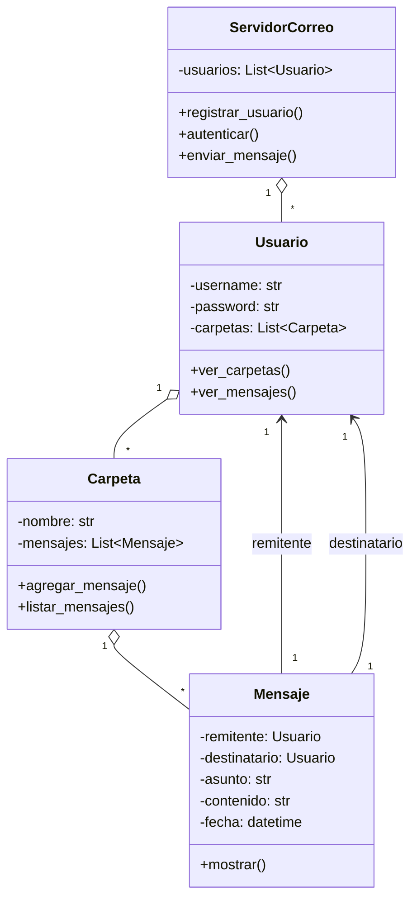

# TP - Servidor de Correo

Este proyecto provee una base orientada a objetos para un servidor de correo simple.

## Objetivos

- Clases principales: `Usuario`, `Mensaje`, `Carpeta`, `ServidorCorreo`.
- Encapsulamiento mediante propiedades y métodos de acceso.
- Documentación con diagrama de clases .

## Diagrama de clases (UML)



## Cómo probar rápidamente

Ejecuta el demo incluido:

```powershell
# Windows PowerShell
python .\app.py
```
