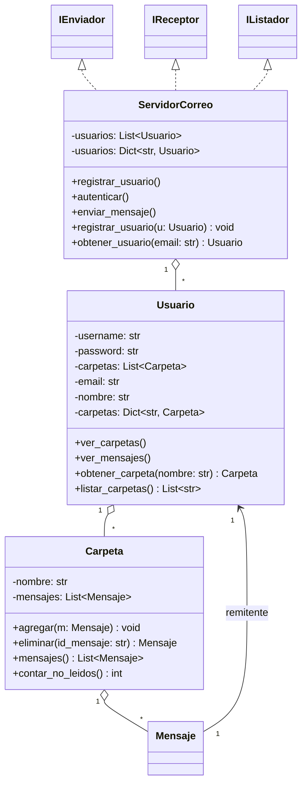

# TP - Servidor de Correo (Código base)

Se va a desarrollar un modelo de servidor de correo, donde el usuario debera registrarse y enviara mensajes a otros usuarios registrados dentro del servidor.
Por defecto se dejo configurado un usuario registrado para la verificación de funcionalidad del mismo.

## Objetivos

- Clases principales: `Usuario`, `Mensaje`, `Carpeta`, `ServidorCorreo`.
- Encapsulamiento mediante propiedades y métodos de acceso.
- Interfaces para enviar, recibir y listar mensajes (ABCs: `IEnviador`, `IReceptor`, `IListador`).
- Documentación con diagrama de clases y justificación de diseño.

## Diagrama de clases (UML)



## Justificación de decisiones

- Interfaces como ABCs: Permiten definir contratos claros para enviar, recibir y listar, habilitando reemplazos o mocks en pruebas sin acoplar al servidor.
- Encapsulamiento: Atributos con guion bajo y acceso por propiedades evitan modificar el estado interno inadvertidamente y facilitan validaciones futuras sin romper clientes.
- Carpeta on-demand: `Usuario.obtener_carpeta` crea carpetas dinámicamente para flexibilidad; aun así se inicializan `Entrada`, `Enviados` y `Papelera` por defecto.
- Inmutabilidad parcial de `Mensaje`: La mayoría de atributos son de solo lectura; el estado de lectura cambia con `marcar_leido` para mantener el historial consistente.
- Identidad con UUID: `Mensaje` usa IDs únicos para operaciones como eliminar o trazar.

## Cómo probar rápidamente

Ejecuta el demo incluido:

```powershell
# Windows PowerShell
python .\app.py
```

Deberías ver listados de la bandeja de entrada y enviados de dos usuarios de ejemplo.

## Próximos pasos sugeridos

- Validaciones de formato de email y normalización.
- Búsqueda y filtrado (por remitente, asunto, fecha, leído/no leído).
- Persistencia (archivos JSON, SQLite) y repositorios.
