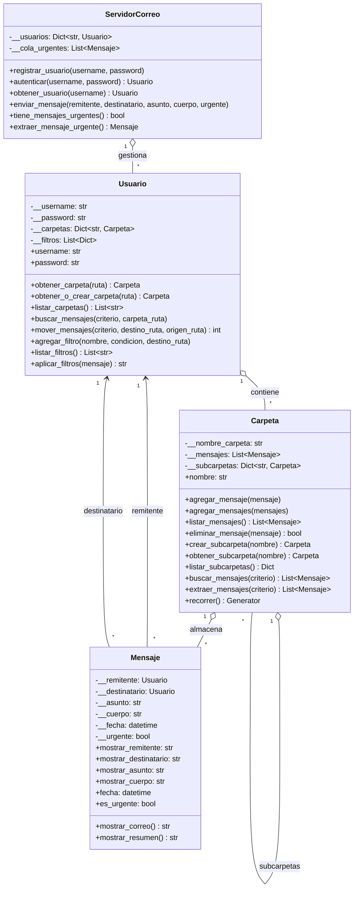

# TP - Servidor de Correo

## Entregas Anteriores

- Se realizaron las correcciones solicitadas en la ultima entrega con respecto a la lógica de recursividad de las carpetas y subcarpetas permitiendo las operaciones de busqueda y movimiento de mensajes.
- Se integró la librería de "pytest" para verificar el correcto funcionamiento del servidor y hacer pruebas límites.
- Se amplió el Abstract.md para mejorar la documentación del código.
- Se investigáron buenas practicas y se utilizáron de la libreria de "typing" Callable, Dict, List, Optional para describir la forma de los datos y las funciones.

## Nueva Entrega - Refactorización Arquitectónica

El proyecto ha sido completamente reestructurado siguiendo principios de diseño modular y separación de responsabilidades:

- **Modularización completa**: El código se organizó en una arquitectura de capas dentro de `src/`
- **Separación de responsabilidades**: Models, Algorithms, Services y UI claramente diferenciados
- **Algoritmos documentados**: Implementación de BFS/DFS, búsqueda recursiva y ordenamiento con análisis de complejidad
- **Servicios de negocio**: Gestores especializados para mensajes, carpetas, filtros y preparación para red de servidores
- **Mantenibilidad mejorada**: Código más limpio, testeable y extensible

## Estructura del Proyecto

```
TP-ServicioDeCorreo/
├── src/                        # Código fuente principal
│   ├── models/                 # Clases del modelo de datos
│   │   ├── __init__.py
│   │   ├── usuario.py          # Clase Usuario
│   │   ├── mensaje.py          # Clase Mensaje
│   │   ├── carpeta.py          # Clase Carpeta (estructura de árbol)
│   │   └── servidor_correo.py  # Clase ServidorCorreo
│   │
│   ├── algorithms/             # Algoritmos implementados
│   │   ├── __init__.py
│   │   ├── busqueda_recursiva.py   # Búsqueda recursiva en carpetas
│   │   ├── ordenamiento.py         # Algoritmos de ordenamiento de mensajes
│   │   └── recorrido_grafo.py      # BFS/DFS para recorrido de carpetas
│   │
│   ├── services/               # Lógica de negocio
│   │   ├── __init__.py
│   │   ├── gestor_mensajes.py  # Gestión de envío/recepción de mensajes
│   │   ├── gestor_carpetas.py  # Operaciones sobre carpetas
│   │   ├── gestor_filtros.py   # Aplicación de filtros automáticos
│   │   └── gestor_red.py       # Gestión de red de servidores (futuro)
│   │
│   └── ui/                     # Interfaz de usuario
│       ├── __init__.py
│       ├── cli.py              # Interfaz de línea de comandos
│       └── menu.py             # Sistema de menús
│
├── tests/                      # Pruebas unitarias
│   └── test_correo.py
│
├── docs/                       # Documentación
│   └── abstract.md
│
├── app/                        # Código legacy (deprecado, mantener para compatibilidad)
├── main.py                     # Punto de entrada principal
├── requirements.txt            # Dependencias del proyecto
└── readme.md                   # Este archivo
```

## Objetivos

- Modelar las clases principales: ServidorCorreo, Usuario, Carpeta y Mensaje.
- Aplicar encapsulamiento mediante atributos privados y propiedades/métodos de acceso.
- Implementar una interfaz mínima de interacción (registro, autenticación y envío/listado de mensajes).
- Ver también el [Abstract](./docs/abstract.md) con objetivos, decisiones y alcance.
- Automatizar la clasificación de mensajes mediante filtros configurables por usuario.
- Priorizar mensajes urgentes utilizando una cola de prioridad dedicada.

## Complejidad y eficiencia

- **Búsqueda recursiva**: la búsqueda recorre todas las carpetas y subcarpetas de forma recursiva. En el peor caso es `O(n)` donde `n` es la cantidad total de mensajes almacenados en todo el árbol de carpetas.
- **Movimiento de mensajes**: la extracción y reubicación también recorre recursivamente, con complejidad `O(n)` en el peor caso si se visita cada carpeta del árbol.
- **Aplicación de filtros**: por cada mensaje recibido se evalúan las reglas configuradas (`O(r)` donde `r` es la cantidad de filtros del usuario). La evaluación se detiene cuando un filtro coincide.
- **Cola de urgentes (FIFO)**: las inserciones al inicio y extracciones al final de la lista son `O(1)` amortizado. No se usa prioridad numérica; el orden es por llegada (primero en llegar, primero en salir).

## Casos límite considerados

- **Carpetas inexistentes**: al intentar mover mensajes hacia una carpeta que no existe, el sistema informa el error o crea la carpeta automáticamente según la configuración del usuario.
- **Búsquedas sin resultados**: se devuelve una lista vacía sin generar errores.
- **Cola de urgentes vacía**: al consultar mensajes urgentes cuando no hay ninguno pendiente, se informa al usuario sin fallar.
- **Filtros con carpetas destino ausentes**: pueden crearse automáticamente (si `crear_destino=True`) o ignorarse si el usuario prefiere no crear carpetas nuevas.

## Diagrama de clases (UML)


```mermaid
classDiagram
    direction TB

    class ServidorCorreo {
        -__usuarios: Dict~str, Usuario~
        -__cola_urgentes: List~Mensaje~
        +registrar_usuario(username, password)
        +autenticar(username, password) Usuario
        +obtener_usuario(username) Usuario
        +enviar_mensaje(remitente, destinatario, asunto, cuerpo, urgente)
        +tiene_mensajes_urgentes() bool
        +extraer_mensaje_urgente() Mensaje
    }

    class Usuario {
        -__username: str
        -__password: str
        -__carpetas: Dict~str, Carpeta~
        -__filtros: List~Dict~
        +username: str
        +password: str
        +obtener_carpeta(ruta) Carpeta
        +obtener_o_crear_carpeta(ruta) Carpeta
        +listar_carpetas() List~str~
        +buscar_mensajes(criterio, carpeta_ruta)
        +mover_mensajes(criterio, destino_ruta, origen_ruta) int
        +agregar_filtro(nombre, condicion, destino_ruta)
        +listar_filtros() List~str~
        +aplicar_filtros(mensaje) str
    }

    class Carpeta {
        -__nombre_carpeta: str
        -__mensajes: List~Mensaje~
        -__subcarpetas: Dict~str, Carpeta~
        +nombre: str
        +agregar_mensaje(mensaje)
        +agregar_mensajes(mensajes)
        +listar_mensajes() List~Mensaje~
        +eliminar_mensaje(mensaje) bool
        +crear_subcarpeta(nombre) Carpeta
        +obtener_subcarpeta(nombre) Carpeta
        +listar_subcarpetas() Dict
        +buscar_mensajes(criterio) List~Mensaje~
        +extraer_mensajes(criterio) List~Mensaje~
        +recorrer() Generator
    }

    class Mensaje {
        -__remitente: Usuario
        -__destinatario: Usuario
        -__asunto: str
        -__cuerpo: str
        -__fecha: datetime
        -__urgente: bool
        +mostrar_remitente: str
        +mostrar_destinatario: str
        +mostrar_asunto: str
        +mostrar_cuerpo: str
        +fecha: datetime
        +es_urgente: bool
        +mostrar_correo() str
        +mostrar_resumen() str
    }

    ServidorCorreo "1" o-- "*" Usuario : gestiona
    Usuario "1" o-- "*" Carpeta : contiene
    Carpeta "1" o-- "*" Mensaje : almacena
    Carpeta "1" o-- "*" Carpeta : subcarpetas
    Mensaje "*" --> "1" Usuario : remitente
    Mensaje "*" --> "1" Usuario : destinatario
```

## Cómo probar rápidamente

Ejecuta el sistema desde la raíz del proyecto:

```bash
# Bash o PowerShell
python main.py
```

O usando el módulo directamente:

```bash
python -m src.ui.cli
```

## Pruebas automáticas

Se añadieron pruebas unitarias con `pytest` para cubrir la búsqueda recursiva, el movimiento de mensajes, la aplicación de filtros y la cola de urgentes.

```bash
pip install pytest  # en caso de no tenerlo instalado
pytest -q
```

## Manual de uso

- Ejecutar el código con `python main.py` desde la raíz del proyecto.
- Seleccionar alguna de las opciones listadas en el menú:
  - **Registrarse o ingresar** con usuario y contraseña.
  - **Enviar mensajes** a otros usuarios registrados, marcándolos como urgentes si es necesario.
  - **Ver mensajes** de Entrada o Enviados, seleccionando un mensaje para leer el contenido completo.
  - **Crear subcarpetas** anidadas (ejemplo: `Entrada/Proyectos/2025`).
  - **Buscar y mover mensajes** por texto en asunto o cuerpo, de forma recursiva en toda la jerarquía.
  - **Configurar filtros** por asunto para organizar la bandeja automáticamente.
  - **Ver mensajes urgentes** pendientes desde el menú de usuario (se extraen en orden de llegada).

## Arquitectura y Módulos

### `src/models/` - Modelos de Datos

Contiene las clases principales del dominio:

- **Usuario**: Gestión de usuarios con carpetas y filtros
- **Mensaje**: Representación inmutable de mensajes
- **Carpeta**: Estructura recursiva de árbol para organización
- **ServidorCorreo**: Coordinación central del sistema

### `src/algorithms/` - Algoritmos Implementados

Algoritmos con análisis de complejidad documentado:

- **busqueda_recursiva.py**: Búsqueda en árbol de carpetas O(n)
- **ordenamiento.py**: Ordenamiento por fecha, prioridad, remitente O(n log n)
- **recorrido_grafo.py**: BFS/DFS para recorrido de estructuras

### `src/services/` - Lógica de Negocio

Capa de servicios con operaciones de alto nivel:

- **GestorMensajes**: Envío, búsqueda y movimiento de mensajes
- **GestorCarpetas**: Operaciones sobre estructura de carpetas
- **GestorFiltros**: Configuración y aplicación de filtros
- **GestorRed**: Base para comunicación entre servidores (futuro)

### `src/ui/` - Interfaz de Usuario

Sistema de menús modular:

- **cli.py**: Punto de entrada de la interfaz CLI
- **menu.py**: Implementación de MenuPrincipal y MenuUsuario

## Próximos pasos

- Implementar interfaz gráfica con tkinter.

## Documentación Completa

📚 Ver [Índice de Documentación](./docs/INDICE.md) para acceso a todos los documentos:

- **abstract.md**: Decisiones de diseño y arquitectura
- **MIGRACION.md**: Guía de migración de código legacy
- **EJEMPLOS.md**: Ejemplos prácticos de uso
- **CONFIGURACION.md**: Setup del entorno de desarrollo
- **RESUMEN_REFACTORIZACION.md**: Resumen completo de cambios

## Modalidad de trabajo

- Se colaboró en conjunto, y se trabajó con LiveShare permitiendo un desarrollo coordinado.
